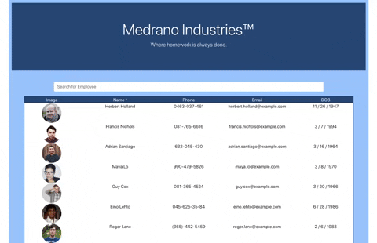

# Employee Directory READ ME
        
## Summary
The employee directory shows employee data for Medrano Industries. The user can sort and search by name in order to find the employee in question.

## Site Picture



## Table of Contents

- [Technologies Used](#Technologies-Used)
- [Learning Points](#Learning-Points)
- [Use](#Use)
- [Installation](#Installation)
- [Code Snippets](#Code-Snippets)
- [Usage](#Usage)
- [Author](#Author)

## Technologies Used
- mongo - used to store and retrieve data
- React - used to build a dybamic and interactive page
- Bootstrap - used to create a clean looking website
- Git - version control system for tracking changes to code
- Github - to host the repository
- Heroku - to host the deployed site

## Learning Points
- React makes so much sense now! Being able to build an application from soup to nuts made all that we learned in class much more tangible and helped the concepts sink in.
- The additional practice with Mongo definitely helped solidify learnings from the last project.
- There are MANY ways to structure React components, pages, states, etc which means that there are many ways to get it right and many ways to get it wrong!

## Dependencies
```
express
axios
mongoose
```
## Installation
To interact with the website, access the heroku deployed site. To create your own employee directory:

- You will need to download this folder into your computer either by cloning the git repository or downloading the files are a zip.
- Once the files are accessible in tour local computer, navigate inside the employee tracker folder and do an install of the following packages by using: 
```
npm install mongoose
npm install express
npm install axios

```

- Run the program by using the following command:
```
node server.js
```

- You will also need to create a React app using the following command:
```
npx create-react-app <nameofApp>
```

- There is no seed data provided but calls to the api route to random user data can help you generate users


## Usage
- To view and sort basic employee data

## Code Snippet
One of the biggest challenges in this project dealt with search and filter. I am highlighting the sorting function because it was the most challenging of the two for me. Sort Employees is called when the user clicks on a "^" on the page.

```
function sortEmployees(ordering) {
        if (ordering === "desc") {
            let desc = employees.sort((b, a) =>
                a.name.localeCompare(b.name))
            let descF = filteredEE.sort((b, a) =>
                a.name.localeCompare(b.name))
            setEmployees(desc)
            setFilteredEE(descF)
            setSorted("asc")
        }
        else if (ordering === "asc") {
            let asc = employees.sort((b, a) =>
                b.name.localeCompare(a.name))
            let ascF = filteredEE.sort((b, a) =>
                a.name.localeCompare(b.name))
            setEmployees(asc)
            setFilteredEE(ascF)
            setSorted("desc")
        }
    }
```


## Author
[GitHub](https://github.com/analoo)

